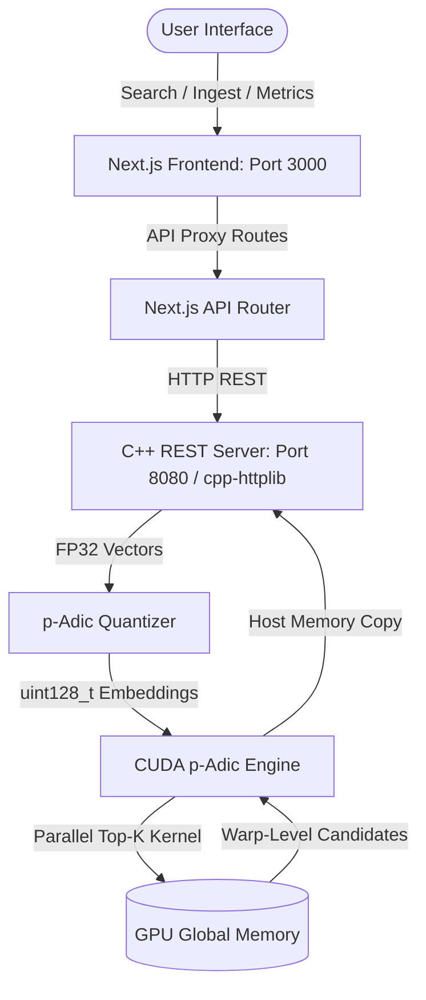

# p-Adic Ultrametric Vector Search Engine

A GPU-accelerated nearest-neighbor vector search engine based on p-adic quantization and ultrametric distance metrics. This project features a high-performance C++20/CUDA backend REST API and a Next.js 14 dashboard with a dynamic D3.js ultrametric tree visualizer.

---

## 🛠️ System Architecture

The application is split into two primary components connected via a REST API:
1. **Frontend (Next.js 14)**: A TypeScript dashboard that allows users to query, ingest, and visualize the dataset structure. It communicates with the C++ backend through API proxy routes and includes a D3-powered dendrogram tree visualization.
2. **Backend (C++20 / CUDA)**: A high-throughput HTTP server that manages the GPU memory, performs real-time quantization, and executes the ultrametric search using a custom CUDA kernel.



---

## 🧮 Mathematical & Computational Foundation

### 1. p-Adic Quantizer
Continuous floating-point vectors are mapped into discrete 128-bit p-adic integers ($p = 2$).
* **Methodology**: Sign-based hashing (bits are set to `1` if $x_i \ge 0$, and `0` if $x_i < 0$).
* **Properties**: Maps a 128-dimensional floating-point vector into a 128-dimensional binary hypercube. This sign-based embedding preserves the cosine (angular) similarity of the original vectors, aligning perfectly with the metric properties of 2-adic spaces.

### 2. 2-Adic Ultrametric Distance
In the binary hypercube, the 2-adic ultrametric distance $d_2(x, y)$ is computed using efficient bitwise operations:
$$d_2(x, y) = 2^{-v_2(x \oplus y)}$$
Where $v_2$ is the 2-adic valuation (the position of the first differing bit, equivalent to the number of leading zeros in the XOR difference).
* **CPU/GPU Primitives**: Bitwise XOR (`^`) followed by the Leading Zero Count (`__clz` or `__clzll`).

### 3. CUDA Warp-Level Top-K Search
To search massive datasets with sub-millisecond latencies, the CUDA kernel leverages a hierarchical reduction approach:
* **Grid Size**: $2048$ blocks with $256$ threads each ($524,288$ concurrent execution paths).
* **Warp Reduction**: Threads within a warp ($32$ threads) dynamically track and reduce the top candidates without global memory locks.
* **Host-Side Reduction**: The warp-level candidates ($32$ candidates per warp $\times$ $16,384$ total warps) are transferred back to the CPU where an $O(N \log K)$ partial sort extracts the global Top-$K$ results.

---

## 🚀 Getting Started

### Prerequisites

* **OS**: Windows (with PowerShell) or Linux.
* **C++ Compiler**: MSVC (Visual Studio 2022 Build Tools) or GCC/Clang with C++20 support.
* **CUDA**: CUDA Toolkit (v11.x / v12.x) and compatible NVIDIA GPU drivers.
* **Build System**: CMake (v3.24 or higher).
* **Node.js**: Node.js (v18.x or higher) and `npm`.

### Quick Start (One-Shot Launcher)

The project includes a PowerShell script `run_all.ps1` that automates CMake builds, dependencies resolution, environment variables setup, and starts both servers.

1. Open PowerShell and navigate to the project directory:
   ```powershell
   cd "C:\e\Parth\Nvidia"
   ```
2. Run the launcher:
   ```powershell
   .\run_all.ps1
   ```

#### Launcher Options:
* `-SkipBuild`: Starts the servers immediately, skipping the C++ build step.
* `-Port <int>`: Runs the backend server on a custom port (default: `8080`).
* `-CudaArch <string>`: Sets the target GPU architecture (e.g., RTX 30xx = `86`, RTX 40xx = `89`, A100 = `80` [default]).
* `-Dataset "<path>"`: Specifies the path to a binary dataset file to load at startup.

---

## 📡 Backend API Contract

The C++ backend HTTP server listens on port `8080` (or custom port via launcher) and exposes the following REST endpoints:

### 1. `POST /search`
Executes an ultrametric nearest-neighbor search for a query vector.

* **Payload**:
  ```json
  {
    "vector": [0.1, -0.5, 0.9, ...], 
    "k": 10
  }
  ```
* **Success Response**:
  ```json
  {
    "status": "success",
    "message": "Search completed",
    "data": [
      { "index": 42, "distance": 18 },
      { "index": 128, "distance": 14 }
    ]
  }
  ```

### 2. `POST /ingest`
Loads a new batch of floating-point vectors into GPU memory (quantization is done on the fly).

* **Payload**:
  ```json
  {
    "vectors": [
      [0.1, 0.2, ...],
      [-0.9, 0.5, ...]
    ]
  }
  ```
* **Success Response**:
  ```json
  {
    "status": "success",
    "message": "Dataset ingested successfully",
    "data": {
      "size": 2
    }
  }
  ```

### 3. `GET /metrics`
Returns system metrics, uptime, and database states.

* **Success Response**:
  ```json
  {
    "status": "success",
    "message": "Metrics retrieved",
    "data": {
      "dataset_size": 100000,
      "uptime_seconds": 1204,
      "quantizer_target_dim": 128
    }
  }
  ```

---

## 📂 Binary Dataset Format

For high-speed bulk ingestion of large datasets (millions of vectors), the system supports loading raw binary files directly.

### File Structure:
1. `uint32_t num_vectors` : Total number of vectors (4 bytes).
2. `uint32_t dimension`   : Vector dimension (4 bytes). Must be equal to `128`.
3. `float32_t[] data`     : Row-major contiguous array of single-precision floating-point numbers.

### Generating Datasets (Python Example):
```python
import numpy as np

num_vectors = 1_000_000
dimension = 128

# Generate random FP32 vectors
data = np.random.randn(num_vectors, dimension).astype(np.float32)

with open('data/vectors.bin', 'wb') as f:
    f.write(np.uint32(num_vectors).tobytes())
    f.write(np.uint32(dimension).tobytes())
    f.write(data.tobytes())
```

---

## 🗂️ Project Structure

```
.
├── run_all.ps1                   # One-shot launcher for frontend and backend
├── README.md                     # Root project documentation (this file)
│
├── Backend nvidia/
│   └── Backend nvidia/
│       ├── CMakeLists.txt         # CMake build configuration
│       ├── data/
│       │   └── README.md          # Dataset instructions
│       └── src/
│           ├── main.cpp           # Application entrypoint
│           ├── core/              # Quantizer and p-adic embedding math
│           ├── cuda/              # CUDA engine wrapper and search kernels
│           ├── server/            # HTTP server & API endpoints handlers
│           └── utils/             # JSON parsing, CUDA error checking & Logging
│
└── frontend/
    └── frontend/
        ├── package.json           # Node dependencies
        ├── tailwind.config.js     # Tailwind setup
        ├── tsconfig.json          # TS config
        └── src/
            ├── app/               # Next.js App Router (Layout & Pages)
            ├── components/        # Sidebar, main dashboard & D3 tree visualizer
            └── lib/               # API clients, axios wrappers, mock fallback
```
